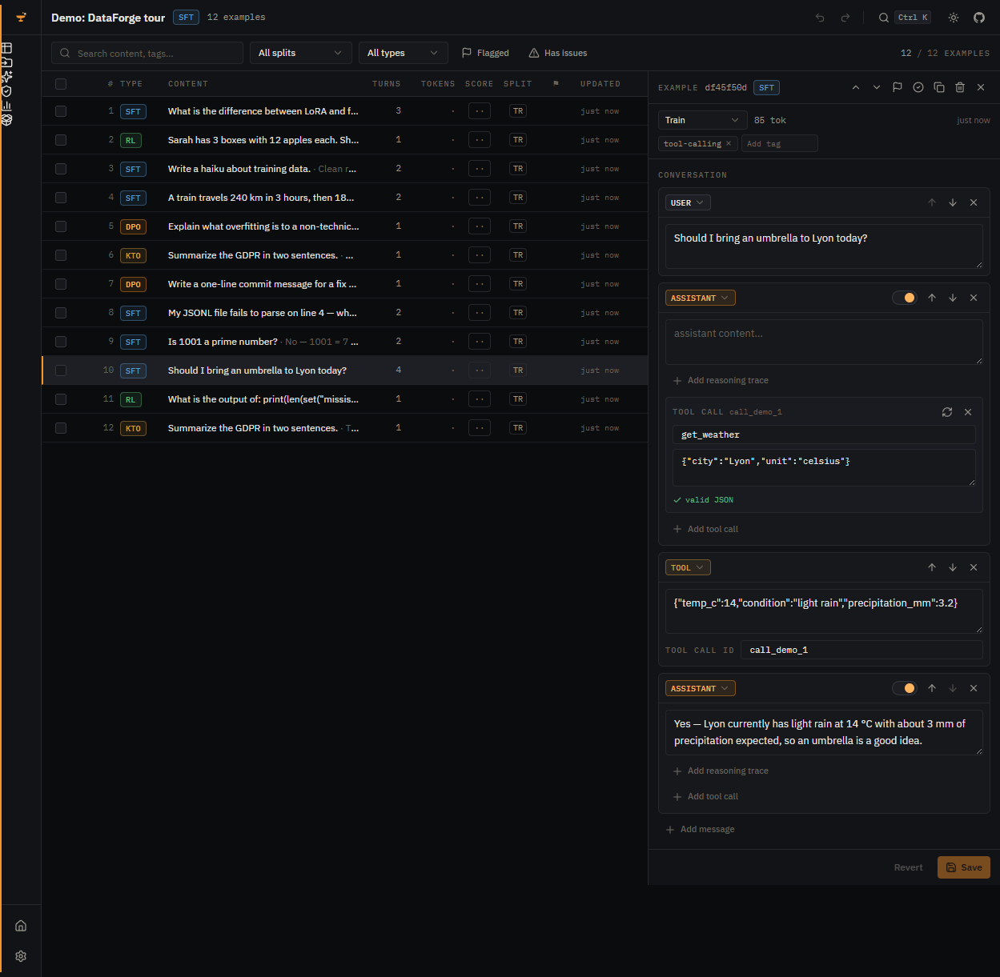

  

# ⚒️ Dataforge Studio v2

A workbench for building LLM fine-tuning datasets. Import data from anywhere, edit it in a proper grid, check its quality, generate synthetic examples, and export ready-to-train packages for the frameworks people actually use in 2026.

Everything runs in your browser. There is no server, no account, no upload. Your training data never leaves your machine.



## What it does

**Import**
- Files: JSONL, JSON, CSV, Parquet, Excel, PDF, DOCX, Markdown, plain text
- Hugging Face datasets, streamed straight from the Hub
- Paste from clipboard
- Auto-detects Alpaca, ShareGPT, OpenAI messages, DPO pairs and KTO formats

**Four dataset types, stored properly**
- SFT chat conversations, including tool calls and reasoning traces as structured fields
- DPO preference pairs (prompt, chosen, rejected)
- KTO unpaired feedback (prompt, completion, label)
- RL prompts with verifiable answers, for GRPO and friends

Reasoning traces and tool calls are kept as separate fields, not baked into text. They render correctly for each target model at export time: `<think>` tags for Qwen and DeepSeek, `[THINK]` for Mistral, the analysis channel for gpt-oss.

**Edit**
- Virtualized grid that handles 50k+ rows without breaking a sweat
- Conversation editor with role switching, reasoning blocks, tool call cards and per-message loss masking
- Side-by-side chosen/rejected editor for preference data
- Bulk operations, undo/redo, keyboard shortcuts, a command palette (Ctrl+K)

**Quality**
- 17 issue checks: empty messages, broken tool calls, PII, encoding damage, context overflow against your target model, and more
- One-click cleaning with preview
- Exact and near-duplicate detection (MinHash)
- Benchmark contamination screening
- Optional LLM-as-judge scoring

**Generate**
- Synthetic data: Self-Instruct, Evol-Instruct, persona-driven, topic-based
- Q&A generation from documents (PDF, DOCX, Markdown)
- On-policy DPO pair building: sample N candidates from your model, judge them, keep best and worst
- AI enhancement: improve, expand, simplify, add reasoning, add code examples

**Export**
| Target | What you get |
|---|---|
| JSONL | OpenAI messages format, works with every modern trainer |
| Axolotl 0.17 | YAML config + dataset |
| TRL 1.5 | Column-typed JSONL + train.py |
| LLaMA-Factory 0.9.5 | dataset_info.json + data file |
| MS-SWIFT 4.3 | Swift-dialect JSONL + CLI command |
| Unsloth | Ready-to-run Python script |
| OpenAI fine-tuning | Upload-ready SFT or DPO files |

Each export is a ZIP with the dataset, a config tuned to your target model, and a short README.

**Model registry**
Around 60 models, current as of June 2026: Qwen 3.5/3.6, Llama 3.x/4, Gemma 3/4, DeepSeek V3/R1/V4, Mistral 3 and Ministral, Phi-4, GLM 4.7/5.1, Kimi K2.x, gpt-oss, Granite 4.1, Nemotron 3, SmolLM3, OLMo 3. Each entry knows its chat template family, context length, reasoning behavior and license.

## AI providers

Bring your own key. Keys are stored in your browser's IndexedDB and sent only to the provider you call.

Supported: OpenAI, Anthropic, Google Gemini, OpenRouter, Groq, and local Ollama. For Ollama, set `OLLAMA_ORIGINS` so the browser can reach it (the Settings page shows the exact command).

LLM responses are cached locally, so re-running a generation on the same input costs nothing.

## Run it locally

You need Node 22+ and pnpm.

```bash
git clone https://github.com/natekali/dataforge.git
cd dataforge
pnpm install
pnpm dev
```

Open http://localhost:5173.

Other commands:

```bash
pnpm test        # run the test suite (557 tests)
pnpm typecheck   # strict TypeScript check
pnpm build       # production build to dist/
```

## Privacy

This is a static site. Datasets live in IndexedDB, in your browser, on your disk. API keys are stored locally and only ever sent to the provider you configured. There is no telemetry, no analytics, no third-party scripts.

Two practical notes:
- Enable persistent storage when the app asks. Safari deletes browser data from sites you haven't visited in 7 days otherwise.
- Use the backup button in Settings before clearing browser data.

## Tech

Vite, React 19, TypeScript strict, Tailwind v4, Dexie (IndexedDB), Web Workers for parsing and quality scans, plain fetch for provider calls. The whole engine (detection, conversion, quality, dedup, templates, exporters) is dependency-light TypeScript under `src/engine/`, tested with Vitest.

```
src/
├─ engine/      data model, registry, detection, quality, dedup, exporters
├─ lib/         storage, providers, AI operations, worker client
├─ workers/     parsing and analysis off the main thread
├─ components/  UI (design system in components/ui)
└─ pages/       one file per route
```

## What happened to V1?

V1 was a Next.js frontend with a Python FastAPI backend. V2 moved everything into the browser: one codebase, zero install for users, and the privacy story became real instead of aspirational. The V1 code is preserved in git history.

## License

MIT. See [LICENSE](LICENSE).
